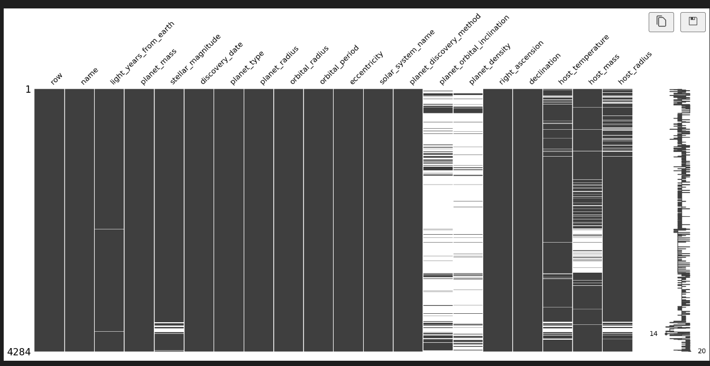
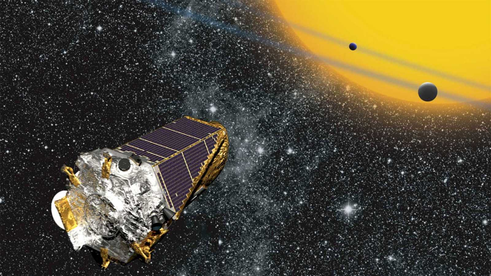

# NASA-ETL-Ironhack
***

***
Este es mi primer proyecto ETL en Ironhack.
El proyecto consta de varias partes.
***

# Extracción

### CSV principal:

La primera era obtener un csv de la pagina www.kaggle.com, que tubiera menos de un 6 de usabilidad.
Yo he elegido un csv de exoplanetas de la NASA, en la cual aparecen los exoplanetas confirmados en su presencia.
El csv que elegi es este:

Este venia bastante bien ordenado y con varios valores nulos. 
Esta seria la tabla:

### Tabla complementaria:

Encontre un tabla complementaria que tenia un dato curioso, que es el indice de impacto del exoplaneta.

En mi entender a menor indice de impacto, con un rango de 0 a 1, a mayor indice mas perpendicular va a colisionar con otro objeto y menor posibilidad de rebotar.

Esta es la definicion en google: 
"En física, el parámetro de impacto b se define como la distancia perpendicular entre la trayectoria de un proyectil y el centro de un campo potencial U(r) creado por un objeto al que se acerca el proyectil."

La tabla es:

### Escrapeo

Queria escrapear la imagen asociada a los exoplanetas pero por problemas técnicos solo me quede con una descripción y año de descubriento del exoplaneta.

Este escrapeo se puede ver en este csv:

# Limpieza
 
La limpieza no fue muy complicada y el resultado lo tendria estaria en este csv:

Esta es una grafica de la libreria missigno que muestra las columnos y los valores nulos dentro de estas.

Unir, limpiar y seleccionar los elementos y columnas a utilizar
Este es el jupyter notebook donde realizo este proceso de limpieza [limpieza](limpieza.ipynb).

# Analisis y Visualización 

Yo me he centradro en una misión en concreto que me parecio curiosa.
Es la misión Kepler, aqui os pongo la descripcion de wikipedia:

"Kepler es un observatorio espacial que orbita alrededor del Sol y buscaba planetas extrasolares, especialmente aquellos de tamaño similar a la Tierra que se encuentran en la zona de habitabilidad de su estrella (véase análogo a la Tierra), llevando a cabo lo que se conoce como misión Kepler. Fue lanzado por la NASA desde Cabo Cañaveral en la madrugada del 6 de marzo de 2009, en un cohete modelo Delta II. El 15 de agosto de 2013 se dio por finalizada la misión principal y en noviembre de 2013 el inicio de la misión extendida K2.6​ El 30 de octubre de 2018, tras nueve años de operación, el combustible del Sistema de control de reacción a bordo del telescopio se agotó, y la NASA anunció su retiro."

### Conclusión